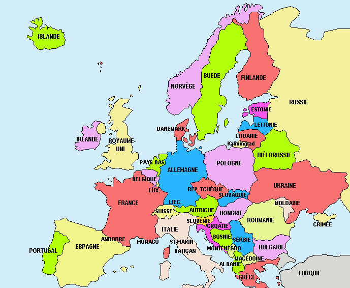
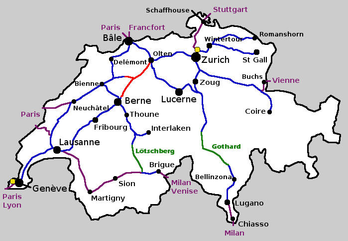

# Réseauter - `points`

En mathématique un **graphe** est un ensemble de **points** liés par des **lignes**.  
De façon générale les *points* sont des objets, souvent appelés *noeuds* ou *sommets*.  
Les lignes sont souvent appelées *liens* ou *arêtes*.

La *Théorie des graphes* est une branche des mathématiques. En informatique le graphe est un outil important pour modéliser :

- des réseaux sociaux (Facebook)
- des réseaux de transportation (Google Maps)
- des réseaux informatiques (Internet)

## Les points

Nous commençons par une liste de points que nous énumérons à partir de zéro.

```{codeplay}
from turtle import *

points = ((0, 0), (-200, 100), (50, 150), (180, -120), (-100, -100))

up()
i = 0
for p in points:
    goto(p)
    dot()
    write(i)
    i = i + 1
```

## Énumérer

Nous pouvons *énumérer* les points de façon plus compacts en utilisant la fonction `enumerate` 
qui associe un entier à chaque élément d'une séquence.

```{codeplay}
print(tuple(enumerate('abc')))
```

Le plus souvent enumerate est utilisé dans une boucle ou un veut 
parcourir une séquence, mais en même temps on a besoin d'un index `i`.

```{codeplay}
noms = ('Kim', 'Jim', 'Ana')
for (i, nom) in enumerate(noms):
    print(i, nom)
```

Ou dans le cas de notre liste de points

```{codeplay}
points = ((0, 0), (-200, 100), (50, 150))
for (i, p) in enumerate(points):
    print(i, p)
```

```{codeplay}
from turtle import *

points = ((0, 0), (-200, 100), (50, 150), (200, 80))
up()

for (i, p) in enumerate(points):
    goto(p)
    dot()
    write(i)
```

## Les lignes

Voici un graphe

```{codeplay}
from turtle import *
up()

points = ((0, 0), (-200, 100), (50, 150), (180, -120), (-100, -100))
lignes = ((0, 1), (0, 2), (2, 3), (4, 3), (4, 0)) 

def line(p, q):
    goto(p)
    down()
    goto(q)
    up()

for (i, p) in enumerate(points):
    goto(p)
    dot()
    write(i)
    
for (i, j) in lignes:
    line(points[i], points[j])
```

## Graphe circulaire

Le graphe circulaire parcourt les points une seule fois et forme un parcours circulaire.

```{exercise}
Ajoutez un point supplémentaire, par exemple à `(0, -50)` ou ailleurs, ainsi que les lignes nécessaires pour garder un graphe circulaire.
```

```{codeplay}
from turtle import *
up()
def line(p, q):
    goto(p)
    down()
    goto(q)
    up()

points = ((0, 50), (-150, 100), (150, 100), (150, -100), (-150, -100))
lignes = ((0, 1), (1, 2), (2, 3), (3, 4), (4, 0)) 

for (i, p) in enumerate(points):
    goto(p)
    dot()
    write(i)
    
for (i, j) in lignes:
    line(points[i], points[j])
```

## Graphe étoilé

Le graphe étoilé est un graphe avec un point spécial, qui est lié à tous les autres points.

```{exercise}
Ajoutez un point supplémentaire, par exemple à `(0, -50)` ou ailleurs, ainsi que les lignes nécessaires pour garder un graphe étoilé.
```

```{codeplay}
from turtle import *
up()
def line(p, q):
    goto(p)
    down()
    goto(q)
    up()
===
points = ((0, 50), (-150, 100), (150, 100), (150, -100), (-150, -100))
lignes = ((0, 1), (0, 2), (0, 3), (0, 4))

for (i, p) in enumerate(points):
    goto(p)
    dot()
    write(i)
    
for (i, j) in lignes:
    line(points[i], points[j])
```

## Graphe roue

Le **graphe roue** est le composé d'un graphe circulaire et un graphe étoilé. Un point spécial lie tous les autres points, qui eux sont reliés par un parcours circulaire.

```{exercise}
Ajoutez un point supplémentaire, par exemple à `(0, -50)` ou ailleurs, ainsi que les lignes nécessaires pour garder un graphe roue.
```

```{codeplay}
from turtle import *
up()
def line(p, q):
    goto(p)
    down()
    goto(q)
    up()
===
points = ((0, 50), (-150, 100), (150, 100), (150, -100), (-150, -100))
lignes = ((0, 1), (0, 2), (0, 3), (0, 4), (1, 2), (2, 3), (3, 4), (4, 1))

for (i, p) in enumerate(points):
    goto(p)
    dot()
    write(i)
    
for (i, j) in lignes:
    line(points[i], points[j])
```

## Graphe complet

Le **graphe complet** est un graphe ou tous les points sont reliés avec tous les autres points.

```{exercise}
Ajoutez un point supplémentaire, par exemple à `(0, -50)` ou ailleurs, ainsi que les lignes nécessaires pour garder un graphe complet.
```

```{codeplay}
from turtle import *
up()
def line(p, q):
    goto(p)
    down()
    goto(q)
    up()
===
points = ((0, 50), (-150, 100), (150, 100), (150, -100), (-150, -100))
lignes = ((0, 1), (0, 2), (0, 3), (0, 4), (1, 2), (1, 3), (1, 4), 
            (2, 3), (2, 4), (3, 4))

for (i, p) in enumerate(points):
    goto(p)
    dot()
    write(i)
    
for (i, j) in lignes:
    line(points[i], points[j])
```

## Attribut des points

Les coordonnées ne sont pas nécessaires pour la structure d'un graphe.
Dans le sens mathématique, un graphe est uniquement déterminé par ses connexions.

Mais pour dessiner une forme spécifique, nous avons besoin des coordonnées des points.
En plus, chaque point peut comporter encore d'autres informations (attributs) tel que:

- taille
- couleur
- étiquette

Dans un graphe social (Facebook), chaque noeud (utilisateur) possède un très grand nombre d'attributs, tels que:
nom, prénom, âge, anniversaire, lieu de résidence, photo de profil, etc.

```{exercise}
Ajoutez un point supplémentaire pour Berne. Choisissez les coordonnées, la taille, couleur et l’étiquette. Ajoutez une connexion pour Berne-Fribourg, et Berne-Vevey.
```

```{codeplay}
from turtle import *
up()
def line(p, q):
    goto(p)
    down()
    goto(q)
    up()
===
points = (((-200, -150), 50, 'red', 'Geneva'),
          ((-20, -100), 60, 'lime', 'Lausanne'),
          ((30, 10), 40, 'cyan', 'Fribourg'),
          ((200, -150), 30, 'pink', 'Vevey'))
          
lignes = ((0, 1), (1, 2), (1, 3))

for (p, d, c, t) in points:
    goto(p)
    dot(d, c)
    write(t)

for (i, j) in lignes:
    line(points[i][0], points[j][0])
```

## Attribut des lignes

Chaque ligne peut avoir des attributs. Pour un graphe dessiné, ceci peut être la couleur et l'épaisseur du trait.

Dans le cas général, par exemple pour un réseau de transportation (Google Map), les attributs de lignes peuvent être:

- distance (en km)
- durée du parcours (en minutes)
- cout en essence (en francs)
- cout en péage (en francs)

Ces informations permettent à Google Map de trouver par exemple le chemin 

- le plus court
- le plus rapide
- le plus écologique
- le meilleur marché

```{exercise}
Ajoutez des connexions supplémentaires pour Geneva-Fribourg et Fribourg-Vevey. Choisissez une couleur et une épaisseur appropriée.
```

```{codeplay}
from turtle import *
up()
def line(p, q):
    goto(p)
    down()
    goto(q)
    up()
===
points = (((-200, -150), 50, 'red', 'Geneva'),
          ((-20, -100), 60, 'lime', 'Lausanne'),
          ((30, 10), 40, 'cyan', 'Fribourg'),
          ((200, -150), 30, 'pink', 'Vevey'))
          
lignes = ((0, 1, 15, 'red'), 
          (1, 2, 20, 'blue'), 
          (1, 3, 10, 'red'))

for (i, j, d, c) in lignes:
    width(d)
    pencolor(c)
    line(points[i][0], points[j][0])

for (p, d, c, t) in points:
    goto(p)
    dot(d, c)
    write(t)
```

## Points aléatoires

Nous allons utiliser la fonction aléatoire `randint()` pour créer des coordonnées qui se trouvent à l'intérieur du canevas.

Nous commençons avec une liste vide `points = []` et dans une boucle nous ajoutons les points.
La fonction `seed(2)` sert à avoir exactement la même configuration à chaque fois quand le programme est lancé.
Vous pouvez changer le paramètre pour `seed()` pour avoir une autre distribution aléatoire.

```{codeplay}
from turtle import *
from random import *
speed(10)
seed(2)
up()

points = []
for i in range(10):
    points += ((randint(-280, 280), randint(-180, 180)),)

for (i, p) in enumerate(points):
    goto(p)
    dot()
    write(i)
```

### Graphe circulaire

Nous allons utiliser la fonction aléatoire `randint()` pour créer des coordonnées qui se trouvent à l'intérieur du canevas.

Nous commençons avec une liste vide `points = []` et dans une boucle nous ajoutons les points.
La fonction `seed(2)` sert à avoir exactement la même configuration à chaque fois quand le programme est lancé.
Vous pouvez changer le paramètre pour `seed()` pour avoir une autre distribution aléatoire.

```{exercise}
Modifiez la couleur des points à `'lime'` et leur diamètre à `10+4*i`, pour que leur taille soit proportionnelle à leur indice.
```

```{codeplay}
from turtle import *
from random import *
speed(10)
seed(2)
up()

def line(p, q):
    goto(p)
    down()
    goto(q)
    up()
===
n = 10
points = []
for i in range(n):
    points += ((randint(-280, 280), randint(-180, 180)),)

lignes = []
for i in range(n):
    lignes.append((i, (i+1) % n))

for (i, p) in enumerate(points):
    goto(p)
    dot()
    write(i)

for (i, j) in lignes:
    line(points[i], points[j])
```

### Graphe étoilé

Nous commençons avec une liste vide `lignes = []` et nous ajoutons 
dans une boucle une ligne `(0, i)` qui va du point 0 vers tous les autres points.

```{codeplay}
from turtle import *
from random import *
speed(10)
seed(2)
up()

def line(p, q):
    goto(p)
    down()
    goto(q)
    up()
===
n = 10
points = []
for i in range(n):
    points += ((randint(-280, 280), randint(-180, 180)),)

lignes = []
for i in range(1, n):
    lignes.append((0, i))

for (i, p) in enumerate(points):
    goto(p)
    dot()
    write(i)

for (i, j) in lignes:
    line(points[i], points[j])
```

### Graphe roue

Nous commençons avec une liste vide `lignes = []` et dans une boucle nous ajoutons :

- une ligne `(0, i)` qui va du point 0 vers tous les autres points,
- une ligne `(i-1, i)` qui relie tous les points extérieurs.

```{codeplay}
from turtle import *
from random import *
speed(10)
seed(2)
up()

def line(p, q):
    goto(p)
    down()
    goto(q)
    up()
===
n = 10
points = []
for i in range(n):
    points += ((randint(-280, 280), randint(-180, 180)),)

lignes = []
for i in range(1, n):
    lignes += ((0, i), (i-1, i))

for (i, p) in enumerate(points):
    goto(p)
    dot()
    write(i)

for (i, j) in lignes:
    line(points[i], points[j])
```

### Graphe arbre

Un graphe **arbre** évoque la ramification des branches d'un arbre.
En théorie des graphes, un arbre est un graphe **acyclique**, donc sans des parcours circulaires.
Dans un arbre chaque point est lié à chaque autre point **par un seul chemin**.

```{codeplay}
from turtle import *
from random import *
speed(10)
seed(2)
up()

def line(p, q):
    goto(p)
    down()
    goto(q)
    up()
===
n = 10
points = []
for i in range(n):
    points += ((randint(-280, 280), randint(-180, 180)),)

lignes = ((0, 2), (2, 4), (2, 1), (2, 3), (1, 5), 
            (3, 6), (3, 7), (1, 8), (1, 9))

for (i, p) in enumerate(points):
    goto(p)
    dot()
    write(i)

for (i, j) in lignes:
    line(points[i], points[j])
```

### Graphe complet

Dans un **graphe complet**, tout point est lié à tous les autres points.
Nous utilisons une boucle imbriquée avec les deux variables d'itération `i` et `j`, pour calculer toutes les combinaisons.

```{codeplay}
from turtle import *
from random import *
speed(10)
seed(2)
up()

def line(p, q):
    goto(p)
    down()
    goto(q)
    up()
===
n = 10
points = []
for i in range(n):
    points += ((randint(-280, 280), randint(-180, 180)),)

lignes = []
for i in range(1, n):
    for j in range(i, n):
        lignes.append((i-1, j))

for (i, p) in enumerate(points):
    goto(p)
    dot()
    write(i)

for (i, j) in lignes:
    line(points[i], points[j])
```

## Exercice

### Pays voisins

Créez un graphe avec les pays d'Europe. Chaque pays est un noeud. Si les pays sont voisins, ils possèdent un lien entre eux.



### Réseau ferroviaire

Créez un graphe qui représente le réseau ferroviaire suisse. Chaque ville est un noeud. Les lignes de chemin de fer représentent les liens.


