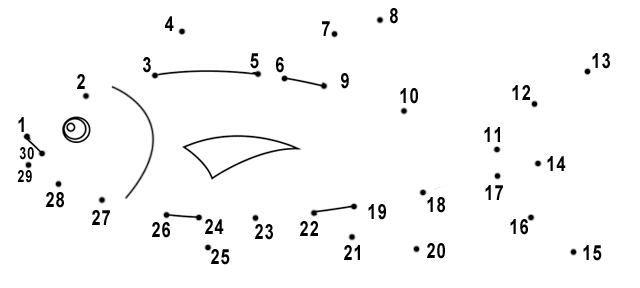

# Positionner - `goto(x, y)`

La fonction `goto(x, y)` permet de positionner la tortue à une position `(x, y)`.


Nous allons voir que :

- la fonction `pos()` retourne la position actuelle de la tortue,
- la fonction `goto(x, y)` positionne la tortue à la position `(x, y)`,
- les fonctions `xcor()` et `ycor()` retournent la coordonnée x ou y,
- les fonctions `setx(x)` et `sety(y)` affectent la coordonnée x ou y.

```{question}
La fonction `pos()` du module `turtle`

{f}`positionne la tortue`  
{f}`retourne la coordonnée x`  
{v}`retourne un tuple de coordonnées`  
{f}`vérifie si une valeur est positive`
```

## La position `pos()`

La fonction `pos()` retourne la position actuelle de la tortue, sous forme d'un tuple `(x, y)`. Dans le dessin de l'escalier, la fonction `write(pos())` affiche les coordonnées de chaque marche, marquée par un point noir.

```{codeplay}
from turtle import *

for i in range(4):
    dot()
    write(pos())    # affiche la position (x, y)
    forward(50)
    left(90)
    forward(30)
    right(90)
    
forward(80)
```

## Valeur `xcor()` et `ycor()`

Les deux fonctions `xcor()` et `ycor()` retournent que la partie x ou y des coordonnées. Dans le dessin de l'escalier, la fonction `write(xcor())` affiche la coordonnée x, et la fonction `write(ycor())` affiche la coordonnée y de chaque marche.

```{codeplay}
from turtle import *

for i in range(4):
    forward(50)
    left(90)
    dot()
    write(xcor())   # affiche la coordonnée x
    forward(30)
    right(90)
    dot()
    write(ycor())   # affiche la coordonnée y
    
forward(80)
```

## Positionner avec `goto()`

La fonction `goto(x, y)` positionne la tortue à la position `(x, y)`. Les coordonnées de la position de l’origine de chaque triangle est affichée.

```{codeplay}
from turtle import *

def triangle():
    down()
    write(pos())
    for i in range(3):
        forward(100)
        left(120)
    up()
        
triangle()      # position à (0, 0)
goto(150, 50)
triangle()      # position à (150, 50)
goto(-200, 80)
triangle()      # position à (-200, 80)
```

## Positionner avec setx()


## Dessiner un polygone

Nous représentons un polygone quelconque avec un tuple de points. Ensuite nous dessinons cette forme géométrique avec une boucle à l'aide de la fonction `goto(p)`.

```{exercise}
Ajoutez 4 points supplémentaires dans le tuple du polygone pour insérer une porte de taille 50x30.
```

```{codeplay}
from turtle import *

poly = ((0, 0), (200, 0), (200, 100), (100, 150), (0, 100), (0, 0))

for p in poly:
    goto(p)
    write(p)    # affiche la position (x, y)
```

## Relier les points

Relier les points est un casse-tête en deux dimensions qui comprend une suite de points numérotés à relier.



Le programme suivant numérote les points du polygone.

```{exercise}
Ne dessinez pas les lignes et placez un point à chaque sommet.
```

```{codeplay}
from turtle import *

poly = ((0, 0), (200, 0), (200, 100), (100, 150), (0, 100), (0, 0))

i = 0
for p in poly:
    goto(p)
    write(i)
    i = i + 1
```

## Déplacer un polygone

Avec le polygone représenté par un tuple de ses coordonnées, il est facile de le déplacer et redessiner le polygone ailleurs.

```{codeplay}
from turtle import *

poly = ((0, 0), (200, 0), (200, 100), (100, 150), (0, 100), (0, 0))

for p in poly:
    goto(p)
    write(p)
    
color('red')
for p in poly:
    q = p[0] - 150, p[1] - 50
    goto(q)
    write(q)
```

## Changer l'échelle

Avec le polygone représenté par un tuple de ses coordonnées, il est facile de le déplacer et redessiner le polygone ailleurs avec un changement d'échelle.

```{codeplay}
from turtle import *

poly = ((0, 0), (200, 0), (200, 100), (100, 150), (0, 100), (0, 0))

for p in poly:
    goto(p)
    write(p)
    
color('red')
for p in poly:
    q = 0.7 * p[0] - 200, 0.7 * p[1] - 100
    goto(q)
    write(q)
```

## Images miroirs

Dans le jeu de Tetris, nous pouvons définir les formes sous forme d'un tuple qui dessine un petit polygone. Multiplier les coordonnées par une variable `a` permet de changer de taille. Changer le signe d'une ou des deux coordonnées permet de trouver l'image miroir.

```{codeplay}
from turtle import *

a = 40
L = ((0, 0), (2, 0), (2, 1), (1, 1), (1, 3), (0, 3), (0, 0))

for p in L:
    q = a * p[0], a * p[1]
    goto(q)
    write(p)
    
for p in L:
    q = a * p[0], -a * p[1]
    goto(q)
    
for p in L:
    q = -a * p[0], -a * p[1]
    goto(q)
```

## Direction `heading()`

La fonction `heading()` renvoie la direction actuelle de la tortue.
La fonction `write(heading())` affiche la direction actuelle de la tortue à chaque extrémité.

```{codeplay}
from turtle import *

a = 100
n = 18

for i in range(n):
    forward(100)
    write(heading())
    backward(100)
    left(360/n)
```

La direction (heading) des 8 segments d'un octogone.

```{codeplay}
from turtle import *

n = 8
for i in range(n):
    write(heading())
    forward(70)
    left(360/n)
```

## Dessiner une grille

```{codeplay}
from turtle import *
up()
a = 40
n = 5

for i in range(n):
    for j in range(n):
        goto(j * a, i * a)
        dot()
        write((i, j))
hideturtle()
```
